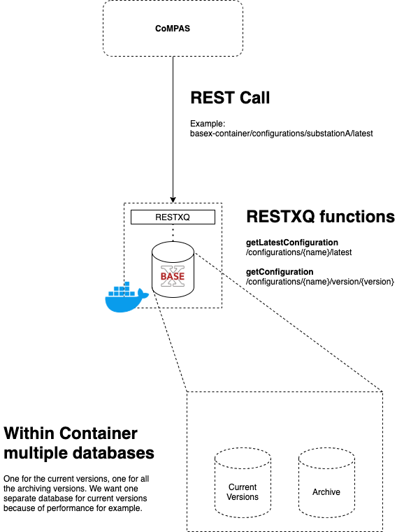
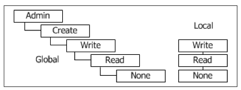

<!--
SPDX-FileCopyrightText: 2021 Alliander N.V.

SPDX-License-Identifier: CC-BY-4.0
-->

## Керування базами даних

## Огляд версій


Щоб реалізувати керування версіями (яке недоступне "з коробки"), нам потрібно додати до BaseX дещо розумне. Цією розумною річчю буде [RESTXQ](http://exquery.github.io/exquery/exquery-restxq-specification/restxq-1.0-specification.html) в нашому випадку.

За допомогою RESTXQ можна створювати функції, використовуючи xQuery і деякі додаткові інтелектуальні можливості, наприклад, змінні і цикли.

Приклад функції RESTXQ:

```
declare
  %rest:path("/search")
  %rest:query-param("term", "{$term}")
  %rest:single
function page:search($term as xs:string) {
  <ul>{
    for $result in db:open('large-db')//*[text() = $term]
    return <li>{ $result }</li>
  }</ul>
};
```

За допомогою RESTXQ можна створити механізм керування версіями. Так, наприклад, у функції редагування (PUT) ми можемо зробити щось на кшталт. При редагуванні вже збереженої конфігурації, зберегти її, збільшивши версію, і зберегти як окрему конфігурацію. Стара конфігурація зберігається в архівній базі даних, поточна версія замінюється в поточній базі даних.

У функції get (GET) ми можемо розрізняти новіші та старіші версії за допомогою RESTXQ. Використовуючи синтаксис xQuery (наприклад, scl[@version=«1»]), ми можемо отримати конкретні версії конфігурації.

### Тип версійності
Як тип керування версіями ми надаємо перевагу [Semantic Versioning](https://semver.org/). Це спрощує керування версіями. Для кожного набору змін CoMPAS запитуватиме, чи це мажор, мінор або патч. Таким чином, версію буде скориговано відповідно до потреб користувача. Прикладом відмінності може бути наступне:
- Набір змін є мажорним, якщо додається повний розділ XML.
- Набір змін є незначним, якщо коригується частина даних.
- Набір змін є виправленням, якщо виправляється друкарська помилка.
Але це залежить від користувача.

Збереження версії буде виконано в поєднанні з розділом історії (tHitem) структури SCL. Цей розділ історії містить кілька елементів історії, тому ви можете створити розділ походження. Будь ласка, перегляньте розділ [Походження](#provenance-overview) для отримання додаткової інформації. Ключовим моментом є те, що tHitem містить наступні атрибути:
- Версія
- Ревізія
- Коли
- Хто
- Що
- Чому

Це створює атрибути походження, і версія є одним з них. Атрибут версії використовуватиметься для позначення останньої версії.

Іншим рішенням може бути [Branch Based Versioning](https://simon-maxen.medium.com/branch-based-versioning-5ebf6ca2bccb). У цьому випадку файл конфігурації може бути «розгалуженим» і може бути «об'єднаним», коли користувач вирішить, що це нормально. Під час злиття можна додати новіший номер версії (це можна зробити у поєднанні із семантичним керуванням версіями).
Це дійсно чудовий спосіб керування версіями, але він занадто складний для наших випадків використання. Ми не бачимо користувачів, які розгалужують файл конфігурації і зберігають його на кілька днів, перш ніж об'єднати. Крім того, такий тип версій не підтримується в BaseX з коробки, тому нам доводиться створювати його самостійно. Якщо порівнювати додану вартість з витраченими зусиллями, то це не те, чого ми хочемо.

## Технічна розмова

### Важливі моменти для пам'яті
- home of BaseX = /srv/basex
- RESTXQ file extension = .xqm
- RESTXQPATH variable (in {home}/webapp/WEB-INF/web.xml) points to directory containing the RESTXQ modules (.xqm files)
  - Default is '.', which is relative to the WEBPATH variable (which is {home}/webapp)

### Приклад використання RESTXQ

- Запуск контейнера BaseX
- Використовуйте оболонку всередині контейнера (docker exec -it <id контейнера> bash)
- створіть модуль RESTXQ: vi /srv/basex/webapp/test.xqm, наприклад
- скопіюйте наступний код:

```
module namespace page = 'http://basex.org/examples/web-page';

declare %rest:path("hello/{$who}") %rest:GET function page:hello($who) {
  <response>
    <title>!Hello { $who }!</title>
  </response>
};
```

- Вам не потрібно перезапускати контейнер, при виконанні REST-запиту він «на льоту» шукає функції.
- Виконайте GET-запит на зразок http://localhost:8984/hello/World
- Ви отримаєте XML, що містить заголовок !Hello World!

### Обмеження
Одна база даних обмежена 2 мільярдами вузлів (також див. [BaseX Statistics](https://docs.basex.org/wiki/Statistics)).
Вузол у цьому випадку - це вузол XML, такий як елемент, атрибут, текст тощо.

### Джерела
http://www.adamretter.org.uk/presentations/restxq_mugl_20120308.pdf

## Права бази даних
В архітектурі мікросервісів база даних мікросервісу повинна бути частиною реалізації цього сервісу і не може бути доступною безпосередньо для інших сервісів. Таким чином, сервіс є слабко пов'язаним і може бути розроблений/масштабований/розгорнутий незалежно.

Існує декілька шаблонів для збереження приватності постійних даних:
- приватні таблиці для кожного сервісу
- schema-per-service
- база даних-сервер-для-сервісу
Як бачимо, 2 варіанти недоступні для BaseX, оскільки це не реляційна база даних. У ній немає ні таблиць, ні схем.
Шаблон «база даних-сервер-на-сервіс» допомагає гарантувати, що сервіси з'єднані без втрат.

Наприклад, служба CIM - IEC 61850 отримує власну базу даних. Якщо інший сервіс хоче отримати SCD-файли від цього сервісу, використовуйте API цього сервісу.

### Де ми встановлюємо права користувача Basex?
Basex має свій [User Management](https://docs.basex.org/wiki/User_Management).

Це досить просто: Basex має користувачів, яких можна створювати. Ці користувачі можуть мати так звані дозволи, які можна застосувати до користувача:



У цьому огляді ми бачимо «Глобальні» та «Локальні» дозволи.
В обох групах дозволів вищий дозвіл включає всі нижчі дозволи. Таким чином, користувач з дозволом «Створювати» також має дозвіл «Читати».

Всі дозволи зберігаються у файлі з назвою users.xml (який можна редагувати вручну) в каталозі бази даних, і він аналізується після запуску BaseX.

### Як нам під'єднати BaseX з a центральним репозиторієм ідентичностей/додатком?
BaseX не має сумісності з центральним репозиторієм ідентичностей (наприклад, Keycloak) "з коробки", але після обговорення цього питання з спільнотою BaseX виявилося, що цього досить зручно досягти за допомогою RESTXQ або xQuery. Існують приклади використання Keycloak:

[Приклад з xQuery](https://code-repo.d4science.org/gCubeSystem/d4science-keycloak-themes/src/branch/master/src/utils/xquery)

[Приклад з RESTXQ](./blob-files/code_examples/auth_sk.xqm)
Автор: Marco Lettere. Орігінал: [BaseX Mailing List](https://mailman.uni-konstanz.de/pipermail/basex-talk/2021-May/016157.html)

Повний опис цього прикладу додається:

>Я додаю тут приклад потоку надання коду OIDC, реалізованого за допомогою RestXQ, дозволу BaseX та обробника помилок.
Файл містить своєрідну бібліотеку для виконання кроків потоку OIDC, а також мінімальний додаток, який реєструється як публічний клієнт всередині keycloak і до якого ви повинні отримати доступ з вашого браузера, звернувшись за адресою http://localhost:8984/authtest або http://localhost:8984/authtest/internal.
Я також включив до нього процедуру виходу з системи для виконання виходу зі зворотного каналу, який закриває сеанс SSO.
Це лише короткий опис більш загального і складного модуля, але він має бути корисним як інструкція, а встановити його так само просто, як і скопіювати файл до теки з веб-додатком BaseX. Використовуйте його на свій розсуд.

### Чи дозволений прямий доступ до бази даних в архітектурі мікросервісів?
Наприклад, для технічного обслуговування, звичайно, дозволено мати прямий доступ до бази даних. Для цього не існує найкращих практик. Для деяких речей вам просто потрібен прямий доступ до бази даних.

Якщо іншим мікросервісам потрібен доступ до даних іншого мікросервісу, єдиний спосіб (найкраща практика) зробити це - за допомогою викликів API.

Джерело:
https://microservices.io/patterns/data/database-per-service.html

## Загальний огляд походження
Наприклад, якщо генерація підстанції зазнає невдачі, ми хотіли б знати походження файлу.
Так буде легше знайти причину.

### W3 PROV
Походження - це інформація про об'єкти, діяльність і людей, залучених до створення даних або речей, яка може бути використана для формування оцінок їхньої якості, надійності або достовірності. Сімейство документів PROV визначає модель, відповідні серіалізації та інші допоміжні визначення, щоб уможливити інтероперабельний обмін інформацією про походження в гетерогенних середовищах, таких як Інтернет. Цей документ містить огляд цього сімейства документів.
 (https://www.w3.org/TR/prov-overview/#Abstract)

W3C має повний стандарт для розширення файлів з інформацією про походження таким чином, щоб вона була стандартизованою і дозволяла взаємозамінність інформації про походження в таких середовищах, як, наприклад, у нашому випадку, XML-середовища. Дизайн PROV базується на рекомендаціях [Provenance Incubator Group](https://www.w3.org/2005/Incubator/prov/charter).

### W3 PROV-XML
Одним з документів W3 PROV є PROV-XML. Цей документ перетворює стандарт PROV на XML-означення, і це те, що ми хочемо.
PROV-XML має 6 компонентів для використання:
- компонент 1: сутності та види діяльності, а також час, коли вони були створені, використані або завершені;
- компонент 2: похідні сутності від інших;
- компонент 3: агенти, що несуть відповідальність за створені сутності та дії, що відбулися;
- компонент 4: пакети, механізм для підтримки підтвердження походження об'єктів;
- компонент 5: властивості для зв'язування сутностей, які посилаються на одне й те саме;
- компонент 6: колекції, що формують логічну структуру для своїх членів.

Нас найбільше цікавить компонент 1. А особливо діяльність.

Існує [Activity complexType](https://www.w3.org/TR/2013/NOTE-prov-xml-20130430/#term-Activity) визначення. Активність в PROV-XML визначено як:

> щось, що відбувається протягом певного періоду часу і діє на або з сутністями; це може включати споживання, обробку, перетворення, модифікацію, переміщення, використання або створення сутностей.
> 
Ось як ми можемо інтерпретувати редагування XML-файлу: як дію.

Дія має час початку і закінчення. У нашому випадку це може бути період від відкриття файлу до його збереження. Вона має тип або активність, яка здебільшого буде редагуванням.

Також можна додати набір додаткових атрибутів. У доданому прикладі додано ім'я хоста. У нашому випадку це не дуже зручно, тому що якщо CoMPAS запускається локально, ім'я хоста не так вже й багато про що говорить. Наразі доцільніше додати атрибут User, який буде пов'язано з майбутнім модулем авторизації/автентифікації oAuth 2.0.

Приклад доданого розділу PROV. Атрибут UserID - це спрощений атрибут для ідентифікації суб'єкта, який виконує дію:

```xml
<prov:document
    xmlns:xsi="http://www.w3.org/2001/XMLSchema-instance"
    xmlns:xsd="http://www.w3.org/2001/XMLSchema"
    xmlns:prov="http://www.w3.org/ns/prov#"
    xmlns:ex="http://example.com/ns/ex#">

  <prov:activity prov:id="ex:a1">
    <prov:startTime>2021-03-16T16:05:00</prov:startTime>
    <prov:endTime>2021-03-16T16:08:00</prov:endTime>
    <prov:type xsi:type="xsd:QName">ex:edit</prov:type>
    <ex:userId>123456</ex:userId>
  </prov:activity>

</prov:document>
```

### IEC-61850-6 hItem (Історія)
Другою опцією є розділ «Історія» файлу SCL.
Цей розділ є стандартним розділом SCL і містить такі поля:
- версія
- ревізія
- коли
- хто
- що
- чому

Як ви можете бачити, це може бути зроблено у комбінації з [версіонністю](#versioning-overview).
Цього достатньо для базового використання, яке нам потрібно. Для кожної версії (наприклад, кожного редагування) до списку SCL буде додано новий елемент hItem.
Таким чином, нам не потрібно розширювати SCL за замовчуванням. Ми можемо просто використовувати стандарт.

### Фінальні думки
Найкраще використовувати секцію Історія в SCL-файлі.
Він досить гнучкий для наших базових потреб, тому у нас є версія, коли, хто і т.д.

У майбутньому нам може знадобитися щось додаткове, наприклад, вихідний CIM-файл від конвертації.
Для цього ми можемо скористатися розділом W3C PROV-XML.
У цьому випадку ми можемо розширити елемент History так званими «приватними» даними, які будуть даними W3C PROV-XML.
Для отримання додаткової інформації про приватні елементи в структурі SCL зверніться до глави 8.3.6 стандарту IEC-61850-6.

### Джерела
https://www.w3.org/TR/prov-xml
