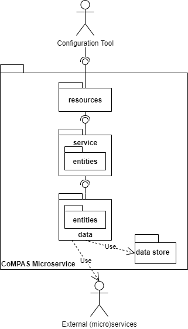

<!--
SPDX-FileCopyrightText: 2021 Alliander N.V.

SPDX-License-Identifier: CC-BY-4.0
-->

## Архітектура функціоналу

### Введення
Ця сторінка описує функціональну архітектуру CoMPAS. CoMPAS надає програмні компоненти, пов'язані з реалізацією моделі IEC 61850, зокрема, для управління профілем енергосистеми та конфігурації системи автоматизації та управління захистом енергосистеми (PACS). Він описує логічну декомпозицію.

### Стандарт IEC61850
Серія IEC61850 - це стандарти та документи, що описують протокол зв'язку між різним обладнанням на підстанції. Вони надають послуги та вимоги для проектування і розгортання автоматизації підстанцій. Це покращує якість електроенергії, знижує експлуатаційні витрати та спрощує технічне обслуговування підстанції.

| Процес | Опис |
| --- | --- |
| **Specify IED** | Під час цього процесу утиліта визначає необхідний IED у файлі ISD. Цей профіль є вхідними даними для виробника, щоб доставити необхідний IED |
| **Specify Substation System** | Під час цього процесу Утиліта визначає характеристики системи підстанції у файлі SSD. Наприклад, ці характеристики може бути виконані на основі даних CIM, наявних в Утиліті |
| **Configuration Substation System** | Під час цього процесу утиліта конфігурує підстанцію. Результатом є файл SCD. Додатковими вхідними даними для цього процесу є файл IID (конфігурація IED) та файл SED (взаємодія з іншими проектами).) |
| **Configure IED** | Процес конфігурації IED. Результатом цього процесу є інстанційований файл ідентифікатора IED. Процес залежить від виробника. Результатом є або файл ICD, або файл IID. Використовується для перетворення SCD у файл CID конкретного виробника, який надсилається на IED |
| **Test** | Повністю сконфігурований IED можна протестувати за допомогою файлів SCD та SSD |
| **Convert CIM/GIS to IEC61850 SLD** | CIM або GIS можна використовувати для конвертації у файли конфігурації 61850 |

Зверніться до [Глосарію](GLOSSARY.md) для ознайомлення зі скороченнями та різними типами файлів 61850.

Зеленим кольором позначено процеси, що входять до сфери застосування CoMPAS.

### Архітектура CoMPAS
#### Контекст

На схемі показано контекст CoMPAS. CoMPAS пропонує набір сервісів IEC61850, що розкриваються за допомогою REST API, які можуть бути використані для створення інструментарію для специфікації, конфігурації, розгортання та тестування підстанцій.

#### Перший рівень розкладання

На цій діаграмі показано послуги, що надаються в рамках CoMPAS. Наразі надаються наступні (мікро)сервіси:

| SСервіс | Опис |
| --- | --- |
| [**CIM to SSD Mapper**](CIM_61850_MAPPING.md) |  Сервіс, який відображає CIM-представлення підстанції у файл опису специфікації системи (SSD) за стандартом IEC61850. |
| **CoMPAS Configuration Manager** | Приклад конфігуратора у вигляді веб-сторінки на основі [OpenSCD](https://github.com/openscd/open-scd). Мікросервіси CoMPAS можна використовувати для створення власного інструментарію конфігурації. Прикладом такого інструменту є CoMPASS Configuration Manager. |
| **CoMPAS SCL Data Service** | Сервіс для зберігання SCL-файлів, розміщений на [Github] (https://github.com/com-pas/compas-scl-data-service). Окрім розміщення SCL-файлів, він також пропонує API для зберігання та отримання цих SCL-файлів. |

_**Буде додано більше сервісів**_

### Архітектура мікросервісів
CoMPAS буде складатися з ряду мікросервісів, які можуть бути використані для побудови інструментів конфігурації підстанції відповідно до IEC61850. У цій ситуації архітектура мікросервісів була обрана тому, що
* CoMPAS надаватиме компоненти, які можна використовувати повторно
* Розробка буде з відкритим вихідним кодом, отже, декількома командами розробників. Оскільки мікросервіси слабо пов'язані і незалежні, це підходить.
* Мікросервіси можна розгортати і тестувати незалежно

На схемі показано загальну структуру мікросервісу. Вона складається з наступних рівнів:

| Рівень | опис |
| --- | --- |
| **Resources** |  Реалізує REST API |
| **Service** | Реалізує бізнес-логіку сервісу |
| **Service Entities** |  Бізнес сутності в рамках сервісу |
| **Data** | Рівень даних відповідає за доступ до сховища або інших сервісів |
| **Data Entities** | Сутності, що відповідають сховищам даних зовнішніх сервісів |

Ми дотримуємося мікросервісної архітектури, застосовуючи наступні правила:
* Мікросервіси розробляються незалежно
* Якщо мікросервісу потрібне сховище (наприклад, база даних), то воно буде частиною мікросервісу
* Якщо потрібне центральне сховище даних, воно повинно бути доступне мікросервісу, який може бути використаний іншими мікросервісами.

### Проєктні рішення
У цьому розділі описано низку проєктних рішень

**REST APIs**:
Мікросервіс пропонує REST API, який представляє сервіс. Сервіси IEC61850 складаються з різних перетворень даних, які можуть зайняти певний час. Перетворення виконується в межах REST-виклику. Це означає, що REST-виклик може зайняти певний час.

**REST Security**:
Для REST-дзвінків буде використовуватися протокол Https. Дані, що передаються за допомогою викликів, повинні розглядатися як конфіденційні і тому повинні бути захищені від розголошення. Тому мікросервіси повинні бути забезпечені сертифікатом. Якщо всі мікросервіси та інструмент конфігурації розгорнуті в одному просторі імен, дозволяється використовувати http.

Потік надання кодів _OAuth 2.0_ буде використовуватися для автентифікації та авторизації. 
Користувач входить в систему за допомогою інструменту конфігурації і отримує код і токен (бажано Java Web Token (JWT)). Токен використовується для доступу до мікросервісів як до ресурсу.
Для цього потрібен OAuth-сервер.

**Deployment**:
Мікросервіси будуть розгорнуті у вигляді докер-контейнера

**Scalability and redundancy**: 
Повинна бути можливість розгортання декількох екземплярів мікросервісу. Ми не очікуємо, що масштабованість буде проблемою. Доступність може бути проблемою, що вимагає надлишкових екземплярів.

