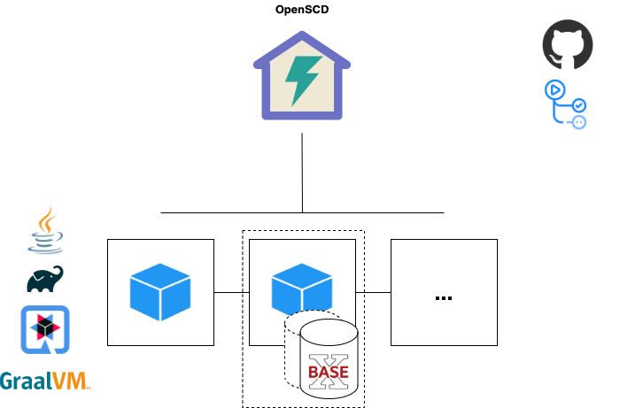

<!--
SPDX-FileCopyrightText: 2021 Alliander N.V.

SPDX-License-Identifier: CC-BY-4.0
-->

# Вибір технології
Правильний вибір технології - ключ до успішного проекту.

# Вибір технологій на цей час

# База даних
Ці Бази даних оцінюються:
- PostgreSQL
- CouchDB
- BaseX
- eXist-db

## Перевірки для визначення бази даних
- База даних повинна мати можливість зберігати XML-дані
- База даних повинна бути реляційною, тому що нам потрібні зв'язки між файлами/частинами файлів/моделями (не впевнений щодо цього)
- База даних повинна бути забезпечена рішеннями, наприклад, частиною образу Docker  
- Повинна бути доступна підтримка на випадок проблем.
- База даних повинна бути з відкритим вихідним кодом, тому що все рішення повинно бути з відкритим вихідним кодом
- Операції повинні мати гарантії ACID, тому що дані повинні бути надійними і послідовними
- Продуктивність не є великою проблемою, але зручно мати базу даних, яка працює швидко!
- Нам не потрібні складні запити, пошук даних досить простий

## Document vs Relational Database
Існує два основних типи баз даних: Реляційні та No-SQL бази даних.
Коли варто обирати той чи інший варіант, можна дізнатися на [Microsoft.com](https://docs.microsoft.com/en-us/dotnet/architecture/cloud-native/relational-vs-nosql-data).

## PostgreSQL
Домашня сторінка: https://www.postgresql.org/
### Pros
- Відкритий вихідний код, реляційна база даних
- PostgreSQL має функції XML для роботи з XML-файлами (XMLTABLE)
- XMLTABLE перетворює XML у формат реляційної таблиці
- Доступна хороша підтримка 
- [Docker image](https://hub.docker.com/_/postgres) доступний
- Має перевірку XML при використанні поля типу XML.

### Cons
- Не місцева база даних XML

## CouchDB
Домашня сторінка: https://couchdb.apache.org/
### Pros
- Єдиний недолік, який ми маємо, є вирішальним.

### Cons
- Не може зберігати XML як ключ/властивість, а лише як blob. Це робить запити дещо складнішими.

## BaseX
Домашня сторінка: https://basex.org/

### Pros
- Місцева база даних XML
- Повністю відкритий вихідний код
- Хороша ліцензія! (BSD)
- Легко налаштовується за допомогою доступного образу Docker
- Крос-платформна
- Активна спільнота
- Кілька API, таких як REST(ful) і HTTP
- [ACID guarantees](https://docs.basex.org/wiki/Transaction_Management)
- Багато [прикладів використання](https://docs.basex.org/wiki/Clients) доступних на різних мовах програмування

### Cons
- Немає чітких сценаріїв використання BaseX
- Версії не доступні з коробки. Потрібно використовувати другу базу даних для створення "версійності", яка створює архівну базу даних і поточну базу даних. А за допомогою RESTXQ відносно легко створити механізм версій. BaseX пропонує [SirixDB](https://sirix.io/) як хорошу альтернативу, якщо нам потрібна NoSQL база даних з механізмом версій.

## eXist-db
Домашня сторінка: http://exist-db.org/exist/apps/homepage/index.html
### Pros
- Місцева база даних XML
- Повністю відкрита
- Кросплатформна
- Активна спільнота (щотижневі зустрічі спільноти, канали Slack, книги)
- Доступний образ Docker
- Кілька мов запитів, таких як HTTP, REST, xQuery та xPath
- Може діяти як графова база даних, тому, наприклад, можливі зв'язки між фрагментами xml
- Підтримує валідацію XML (https://exist-db.org/exist/apps/doc/validation.xml).

### Cons
- Alliander не рекомендує використовувати програмне забезпечення LGPL під час __модифікації__ вихідного коду. Отже, якщо ми захочемо додати функції до eXist-db у майбутньому, у нас можуть виникнути проблеми.
- Відсутній SQL (чи потрібен він?)
- Не має всіх властивостей ACID згідно з [vschart](http://vschart.com/compare/exist-db/vs/postgresql). Ізоляція невідома, не можу знайти інших джерел, які б це підтверджували.
- Маловідомий, немає чітких випадків використання у виробництві. Є декілька [тут](http://showcases.exist-db.org/exist/apps/Showcases/index.html)
- Для роботи eXist потрібне JRE (Java Runtime Environment)

## Остаточне рішення
Я віддаю перевагу eXist-db як базі даних/реєстру для наших XML-даних (залежно від того, що нам потрібно). Це кросплатформенна нативна XML-база даних з відкритим вихідним кодом, активною спільнотою та всіма необхідними нам функціями.

Другий варіант - використання PostgreSQL. Стабільна СУБД з відкритим вихідним кодом, яка також може обробляти XML за допомогою функції XMLTABLE. Але оскільки це не є власною функціональністю PostgreSQL (робота з XML), я надаю перевагу власній базі даних XML, наприклад, eXist-db.

Єдине, що мене турбує - це зрілість eXist-db. Я не можу знайти хороших прикладів використання eXist-db, і я не впевнений в його стабільності у виробництві, наприклад. Дайте мені знати, якщо хтось знає якісь приклади використання, або, можливо, хтось має досвід роботи з eXist-db.

### Проблеми з ліцензуванням
Після обговорення вибору бази даних в Alliander, eXist дійсно є варіантом, але ліцензія може бути проблемою. BaseX може робити те ж саме, що і eXist-db (як здається) і має кращу ліцензію для нашої ситуації (BSD). Крім того, оскільки ідея полягає в тому, щоб мати абстрактний рівень інтерфейсу між CoMPAS і базою даних, люди також можуть вибрати іншу базу даних в майбутньому.

### Чи погано, що BaseX не має версій "з коробки"?
Оскільки BaseX не має версій з коробки, я написав спільноті BaseX про цю проблему. Цитована відповідь:

>Існуючі модулі BaseX не надають готового рішення для функцій керування версіями, але за допомогою XQuery цілком можливо створити рішення для керування версіями. Якщо ви використовуєте RESTXQ для зберігання та отримання даних, ви можете, наприклад, перемістити поточну версію документів в архівну базу даних і замінити її новим документом, що надходить.

Це нормально, друга запущена база даних не є проблемою, тому що це досить легка база даних.

# XML Processing
## Перевірки для визначення обробки XML
- Може маніпулювати/перевіряти конфігураційні файли XML за допомогою правил
- Може бути вбудований в наше рішення
- Інструмент має бути з відкритим вихідним кодом

## RiseClipse
### Pros
- Основне використання - перевірка конфігураційних файлів IEC 61850/IEC CIM, саме те, що нам потрібно.
- Досвід використання в Alliander
- Доступний [Docker-образ] (https://hub.docker.com/r/riseclipse/riseclipse-validator-scl)
- Додавання власних правил перевірки (на мові обмеження об'єктів)

### Cons
- Розробка не виглядає дуже активною
- Спільнота обмежена / не дуже активна ( Дивиться [GitLab](https://gitlab-research.centralesupelec.fr/groups/RiseClipseGroup/-/activity) і [GitHub](https://github.com/riseclipse) )

## Schematron
### Pros
- Існує модуль бібліотеки XQuery для eXist-db (https://github.com/Schematron/schematron-exist)
- Підхід на основі правил. Якщо твердження не виконується, надсилається повідомлення
- Базується на XSLT та xPath, тому дуже гнучкий у маніпулюванні/обробці XML
- Пропонує виправлення XML
- Посилання на інші XML-документи для перевірки обмежень
- XSL-процесор, такий як [Saxon-HE] (http://saxon.sourceforge.net/), є простим у використанні.

### Cons
- Не сам додаток, а XSLT-процесор, такий як [Saxon-HE](http://saxon.sourceforge.net/), який також має відкритий вихідний код.

## Остаточне рішення
Я б порадив використовувати Schematron (у поєднанні з XSLT-процесором) як інструмент для обробки XML. Він може робити те саме, що й RiseClipse, і навіть більше (наприклад, пропонувати виправлення XML, і він більш гнучкий, оскільки працює з нативними XML-технологіями). Крім того, він працює в поєднанні з eXist-db. 

Приклади:

https://en.wikibooks.org/wiki/XQuery/Validation_with_Schematron#Setup_in_eXist-db

https://exist-db.org/exist/apps/doc/validation

https://github.com/Schematron/schematron-exist

RiseClipse також є хорошим кандидатом, оскільки він спеціалізується на валідації IEC 61850/CIM. Єдине, що він не такий гнучкий, як використання Schematron. Але мені дуже подобається комбінація Schematron і eXist-db/BaseX.

# Технологія мікросервісу
Хороша технологія - це ключ до хорошого мікросервісу.

Але майте на увазі: це не остаточна технологія. Кілька мікросервісів можуть мати кілька технологій, в цьому і є крутість мікросервісів. Просто створіть їх і помістіть в мікросервіс, який живе поруч з іншими. Наприклад, за допомогою REST API він може спілкуватися з іншими.

## Перевірки для визначення технології мікросервісу
- Технологія повинна бути прийнята спільнотою з відкритим вихідним кодом
- Технологія не повинна бути абсолютно новою для спільноти, щоб ми могли швидко досягти певного прогресу
- Компоненти повинні бути незалежними для розгортання (наприклад, компонент перетворення CIM, якщо він потребує оновлення)
- Компоненти повинні бути добре відстежуваними (моніторинг)

## Quarkus
https://quarkus.io/
### Pros
- Стек Java, і досвід роботи доступний у спільноті
- Відкритий вихідний код
- Гаряче перезавантаження для швидкої розробки
- Менше багатослівного коду при розробці REST API, порівняно, наприклад, з Java Spring
- Адаптований для GraalVM (універсальна ВМ), що також дуже цікаво для нас (використання ресурсів)
- Величезне зменшення пам'яті порівняно з традиційними хмарними стеками, такими як Java Spring
- Величезне зменшення часу відгуку порівняно з традиційними хмарними стеками, такими як Java Spring
- Підтримується компанією RedHat
- Швидке налаштування мікросервісів за допомогою REST API.

### Cons
- Не підтримує повний набір деяких стандартів EE, таких як Enterprise JavaBeans.
- Відносно нова технологія, фреймворк може містити деякі "помилки новачків". З іншого боку, численні дослідження говорять про зрілість фреймворку, якої він досяг за цей короткий час.

## Java Spring
https://github.com/spring-projects/spring-framework
### Pros
- Мова, якій віддають перевагу в Alliander
- Багато досвіду в спільноті CoMPAS
- Використовуючи Spring (Boot), дуже легко швидко налаштувати мікросервіс
- Велика спільнота - Java використовує синтаксис анотацій, що робить Java чудовою мовою для розробки мікросервісів з точки зору читабельності
- Вона більш зріла порівняно, наприклад, з Spark Java, яка також є варіантом
- Містить чудову функціональність ведення журналів, використовуючи, наприклад, Logback або SLF4J - Доступний інтерфейс командного рядка (CLI)

### Cons
- Досить складно, якщо ви ніколи не працювали з Java Spring
- Java досить повільна порівняно з іншими мовами

## Go Micro
https://github.com/micro/micro
### Pros
- Великі можливості паралельної роботи 
- Швидке виправлення проблем супровідником
- Багато прикладів використання в репозиторії Go Micro

### Cons
- Не така зріла, як, наприклад, Java Spring
- Документація в основному є вихідним кодом, тому може бути не такою легкою для читання для деяких людей
- Помилки не завжди є зрозумілими

## Python Flask
https://github.com/pallets/flask
### Pros
- Python дійсно легко писати, швидке навчання та швидке створення прототипів
- Фреймворк Flask простий у розумінні порівняно з іншими технологіями (небагато накладних витрат або шаблонів)

### Cons
- Якщо ви ніколи раніше не користувалися Flask, вам доведеться трохи попрацювати, щоб освоїтися
- Flask обробляє запити по одному (не асинхронно). Тому кілька запитів займають більше часу. Якщо в CoMPAS буде багато користувачів одночасно, це може стати проблемою

## NestJS w/ NodeJS
https://github.com/nestjs/nest
### Pros
- Основна мікросервісна платформа для підприємств і стартапів, які хочуть використовувати мікросервіси
- Орієнтована на анотації, тому Java-розробники повинні відчувати себе чудово з NestJS
- Документація Swagger автоматично генерується з кінцевих точок API
- NestJS використовує останню версію Typescript, тому йде в ногу з всемогутнім світом Javascript
- Доступний інтерфейс CLI
- Моніторинг стану оголошень доступний за допомогою NPM.

### Cons
- Відсутність документації
- Не дуже велика підтримка, порівняно, наприклад, з Go Micro (Google). Тож питання в тому, як довго він зможе прожити, витримавши конкуренцію з такими великими конкурентами, як Go Micro та Java Spring.

## Остаточне рішення
Python Flask та Java Spring дуже близькі і обидва можуть бути використані для наших цілей.

Перевагою є те, що є більше досвіду роботи з Java Spring порівняно з Python Flask, тому я пропоную використовувати Java Spring. Роб також створив мінімальний життєздатний продукт мікросервісу з використанням Java Spring і BaseX, який дуже швидко налаштовується і працює дуже добре.

NestJS також виглядає дуже багатообіцяюче, але відсутність документації є для мене переломним моментом. Go Micro також є хорошим кандидатом, але недостатня зрілість змусила мене вирішити не зупиняти свій вибір на Go Micro.

Якщо поглянути на використання пам'яті (і час відгуку) Quarkus, то він, безумовно, цікавий для нас. Також погляньте на це [порівняння з Java Spring](https://simply-how.com/quarkus-vs-spring-boot-production-performance)

Оскільки CoMPAS є додатком, який також повинен працювати локально, використання пам'яті є важливим аспектом. Разом з тим, що це сучасний фреймворк для мікросервісів, який підтримується RedHat і є фреймворком Java (з яким ми маємо досвід роботи), це найкращий вибір на даний момент!
