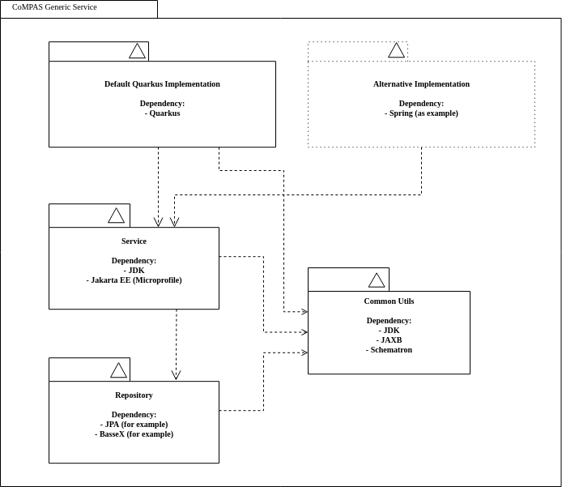

<!--
SPDX-FileCopyrightText: 2021 Alliander N.V.

SPDX-License-Identifier: CC-BY-4.0
-->

## Пропозиція щодо загальних компонентів

Існує дискусія щодо того, яку технологію можна використовувати, оскільки не всім компаніям дозволено використовувати запропоновані Quarkus варіанти технологій. Але для деяких компаній Quarkus є необхідною технологією, щоб зменшити вплив на навколишнє середовище.

Для того, щоб код міг бути використаний якомога більшою кількістю компаній, ми можемо вирішити встановити деякі основні правила, які бібліотеки можуть бути використані в різних частинах сервісу. Нижче наведено приклад того, з яких модулів можна побудувати сервіс.



Наприклад, служба даних SCL має модуль Quarkus REST, який використовує модуль сервісу і репозиторію. Кожен модуль збирається і публікується окремо. Ці артефакти можна використовувати у власних реалізаціях. 
Контейнер виконання за замовчуванням використовує Quarkus з інтерфейсом REST як реалізацію, але специфічна для компанії реалізація може бути побудована, наприклад, за допомогою Spring, але все одно використовуватиме більші частини модуля.

FQuarkus використовує стандартний Jakarta EE, тому багато роботи виконується "з коробки". Quarkus використовує jandex, щоб дізнатися, які боби доступні для використання. Але, як і у Spring, можна також створити клас конфігурації для створення бобів, які не індексуються або навіть не мають анотацій до бобів.

Spring використовує власні анотації, тому завжди потрібна додаткова конфігурація для створення всіх необхідних бобів у класі Spring Configuration. Нижче наведено приклад, як створити боб зі стандартного класу Java.
```
@Configuration
public class ServiceConfiguration {
  @Bean
  @Autowired
  public SomeBeanClass createSomeBean(OtherDependingBean otherBean) {
    return new SomeBeanClass(otherBean);
  }
}
```

Оскільки ми використовуємо лише стандартні класи Java і Jakarta, обидві реалізації (Spring та Quarkus) можуть бути використані для запуску стандартних класів.
