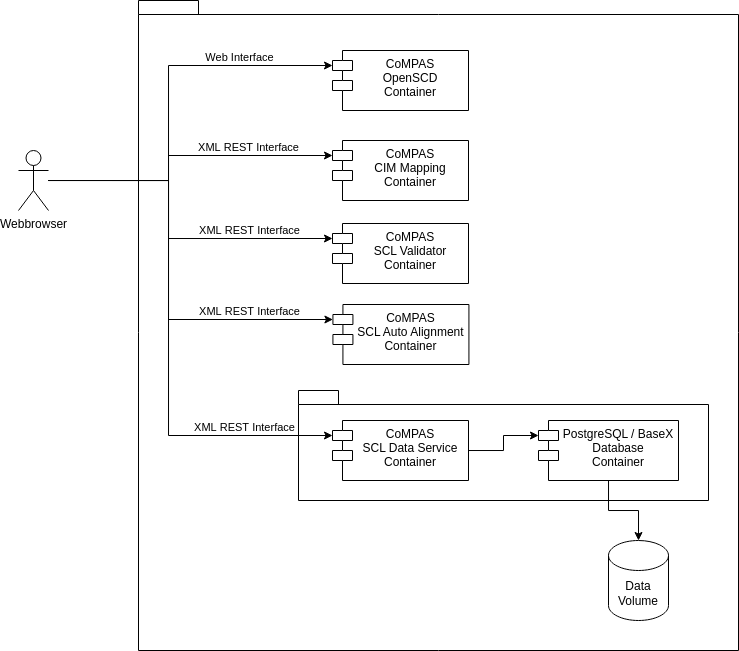

<!--
SPDX-FileCopyrightText: 2021 Alliander N.V.

SPDX-License-Identifier: CC-BY-4.0
-->

## Технічна архітектура

### Вступ
У цьому розділі описано вигляд розгортання CoMPAS.

### Встановлення і розгортання

На діаграмі вище показано вигляд розгортання. Сині компоненти знаходяться в рамках проекту CoMPAS.

**CoMPAS microservice**s збираються з вихідного коду Java на Github (не показано) за допомогою процесу збірки Maven. Результатом є скомпільований java-додаток. 

Результатом CI/CD є **Container Image** в реєстрі Docker. **Container Image** містить один **CoMPAS microservice**. Більше одного мікросервісу CoMPAS може бути присутнім в образі, тільки якщо вони тісно пов'язані між собою і повинні розгортатися і масштабуватися разом.

В рамках процесу CI/CD виконується сканування вихідного коду на предмет безпеки. **Container Image**s мають бути підписаними і є формальними доставниками проекту CoMPAS.

У процесі розгортання **Container Image** розгортається разом з його залежностями (наприклад, базою даних) у **Application**. Це розгортання відбувається за допомогою *Docker Compose*. Для цього надається **docker compose yaml** файл, який розгортає програму за допомогою Docker Compose.

Взагалі кажучи, це гарна ідея розгортати по одній речі в контейнері. Причини:
* Незалежне масштабування: API масштабуються інакше, ніж бази даних
* Незалежне оновлення: оновлення в ізоляції
* Підтримка різних середовищ: контейнерна база даних локально, а керований сервіс у виробництві
* Немає потреби в менеджері процесів

Мікросервіси третіх сторін можуть бути включені в додаток кінцевого користувача або можуть бути необхідними для мікросервісів CoMPAS, але це виходить за рамки проекту.

Розгортання здійснюється користувачами CoMPAS і виходить за рамки проекту.

### Розгортання CoMPAS
Нижче описано поточний вигляд розгортання доступних контейнерів CoMPAS. Цей вигляд буде оновлюватися з часом для додавання нових компонентів, що збираються.

Користувач за допомогою браузера відкриває редактор OpenSCD з контейнера CoMPAS OpenSCD Container. У цьому редакторі доступні плагіни для використання XML REST Services від CoMPAS для відкриття, збереження та перевірки SCL файлів або використання маппера для перетворення файлів. Також є служба автоматичного вирівнювання для позиціонування елементів на однолінійній діаграмі.  

Файли SCL зберігаються в базі даних, наприклад, BaseX або PostgreSQL, яка використовує том для зберігання даних поза контейнером.

Детальну інформацію про різні компоненти можна знайти за наступними посиланнями.

| Компонент                 |                                                                    |                                                                                                               |
|---------------------------|--------------------------------------------------------------------|---------------------------------------------------------------------------------------------------------------|
| CoMPAS SCL Data Service   | [Репозиторій](https://github.com/com-pas/compas-scl-data-service)   | [Документація](https://github.com/com-pas/compas-scl-data-service/blob/main/doc/compas-scl-data-service.md)  |
| CoMPAS OpenSCD            | [Репозиторій](https://github.com/com-pas/compas-open-scd)           |                                                                                                               |
| CoMPAS CIM Mapping        | [Репозиторій](https://github.com/com-pas/compas-cim-mapping)        |                                                                                                               |
| CoMPAS SCL Validator      | [Репозиторій](https://github.com/com-pas/compas-scl-validator)      |                                                                                                               |
| CoMPAS SCL Auto Alignment | [Репозиторій](https://github.com/com-pas/compas-scl-auto-alignment) |                                                                                                               |
